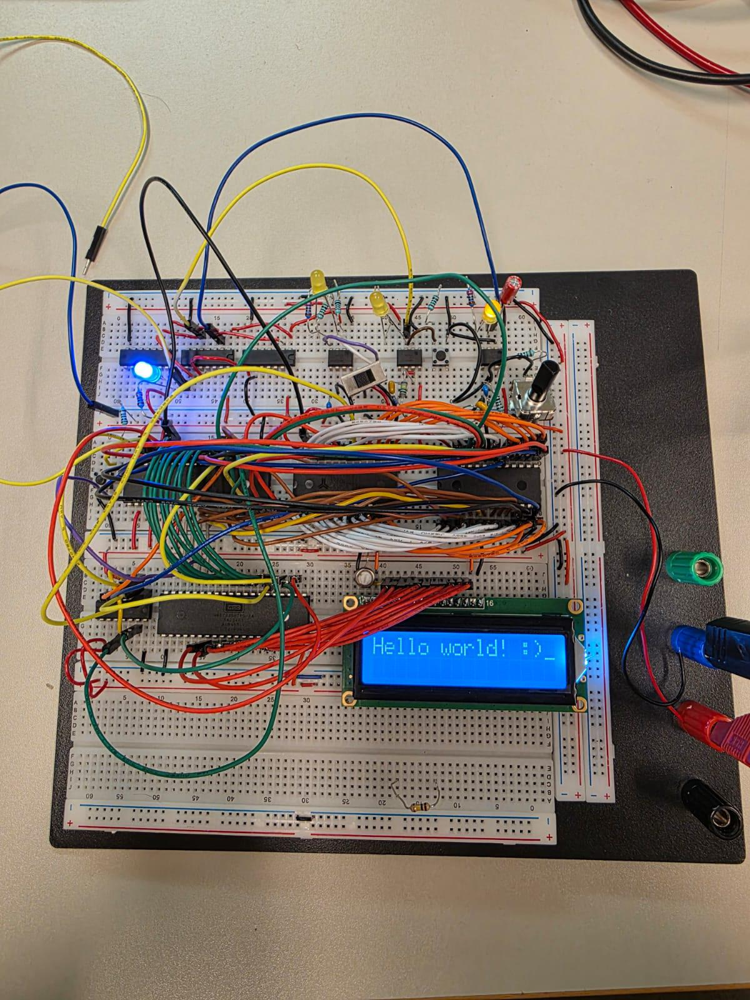

# 65C02-Tietokone

Leipälevylle rakennettu Ben Eaterin materiaaleihin perustuva 65C02-tietokone, tietokoneen perusrakenteen ja toiminnan oppimiseen.

Repositorio sisältää myös oppimispäiväkirjani(project_log), joka sisältää kronologisesti oppimisprosessini konetta rakentaessa. Oppimispäiväkirja sisältää myös virheitä, ongelmia ja keskeneräisiä kohtia, jotka ovat osa oppimisprosessia ja sikis mukana dokumentaatiossa.

Koodini ja tekstini ovat ensisijaisesti oppimista ja ymmärtämistä varten:) 
Kone sisältää nyt 65C02-prosessorin, ROM-ja RAM-muistin, I/O-ohjainpiirin ja oskillaattorin. Projektin kehitys on toistaiseksi tauolla, mutta tarkoitus olisi jatkaa sitä tulevaisuudessa.

